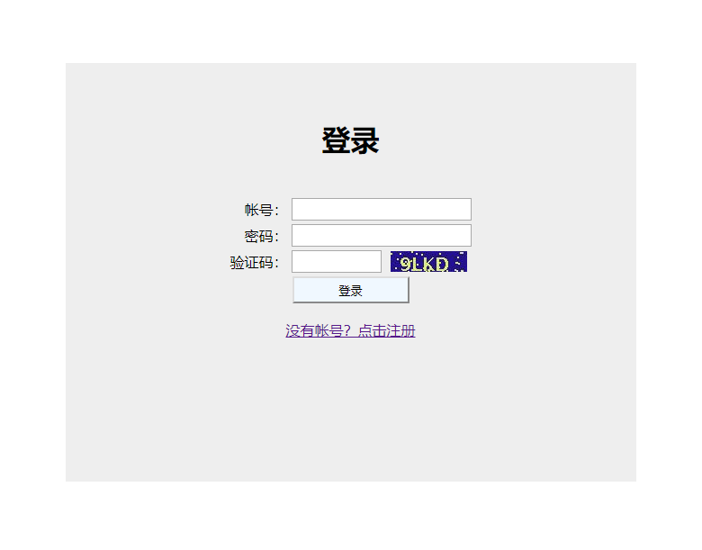
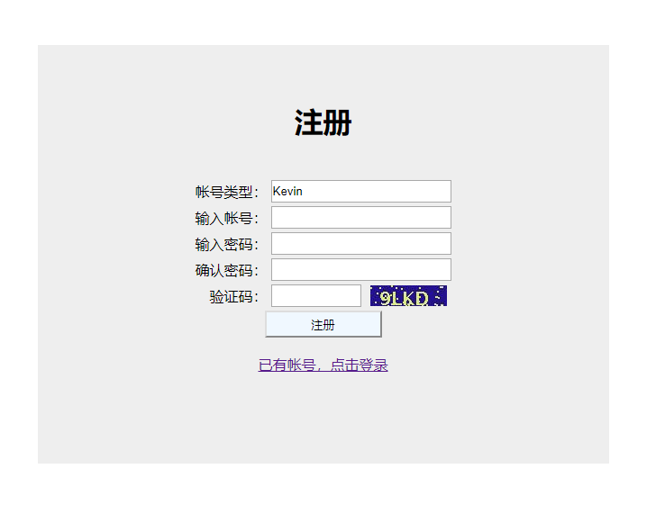

# [网站账号系统示例]
    web_account
    该项目是在学习java过程中做的，比较基础的一个示例，不保证安全性和合理性。

## [环境配置]

1. IDEA
2. maven构建
3. spring + springMVC +mybatis
4. mysql 5.7
5. tomcat 9.0.20

## [安装部署]

1. 安装运行mysql，导入数据库包doc/database/account.sql
2. 安装tomcat
3. IDEA中打开工程，注意修改mysql的连接账号和密码
4. 设置构建目标，选定tomcat位置
5. 运行成功，访问local:8080/account

> 登录界面

> 注册界面

## [About]

> About me
- Author    : Kevin
- Profession: Embedded software engineer(Linux)
- Industry  : AI, robot, IOT
- Email     : wkhome90@163.com

> 其他补充
- 作者以C/C++为主要技术栈，其他辅助了解python、java、Android、后端和前端技术。
- 作者毕业时从事硬件设计工作，后来才转到Linux相关的开发，所以对硬件也相当了解。